# ShopHub: Architecture

## System Architecture Overview
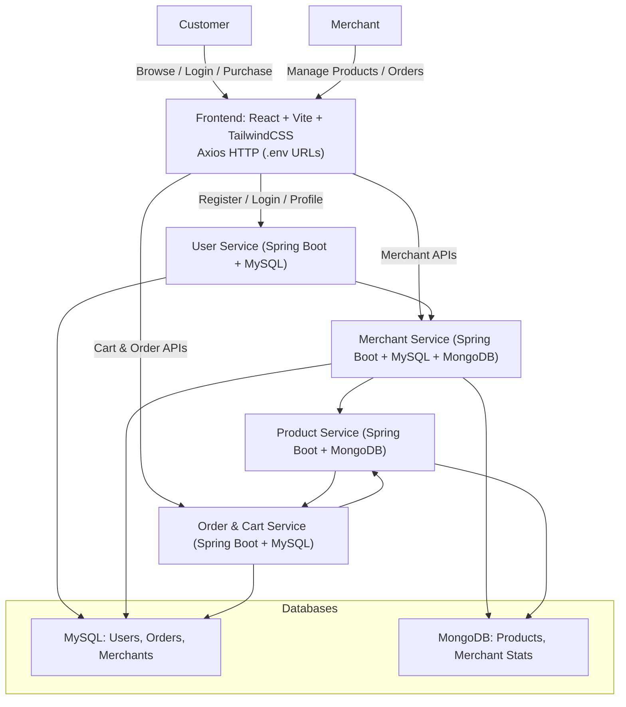

---

## User Login Flow
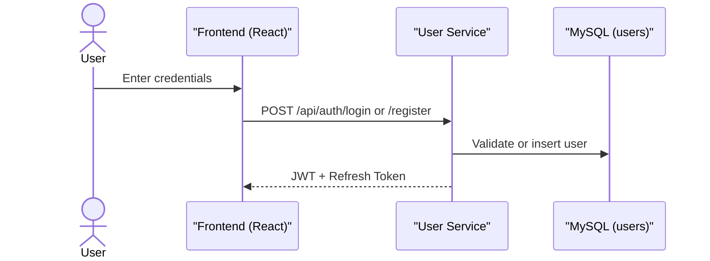

---

## Merchant Product Flow
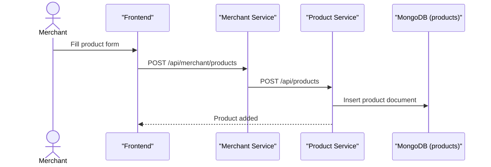

---

## Cart Flow
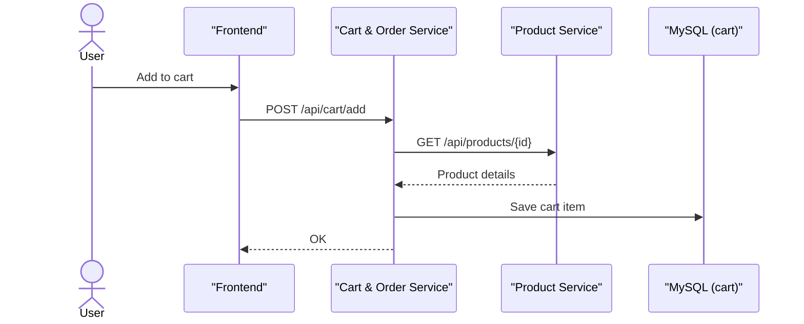

---

##  Order Checkout Flow
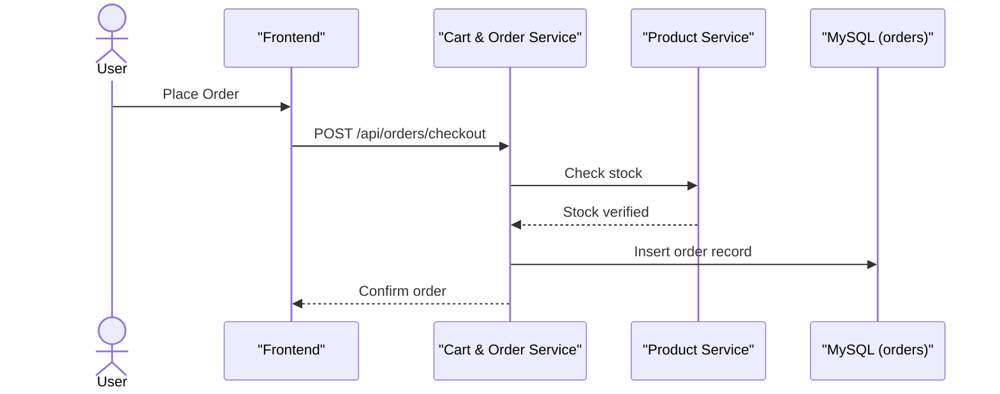

---

##  Entity-Relationship Diagram (ERD)
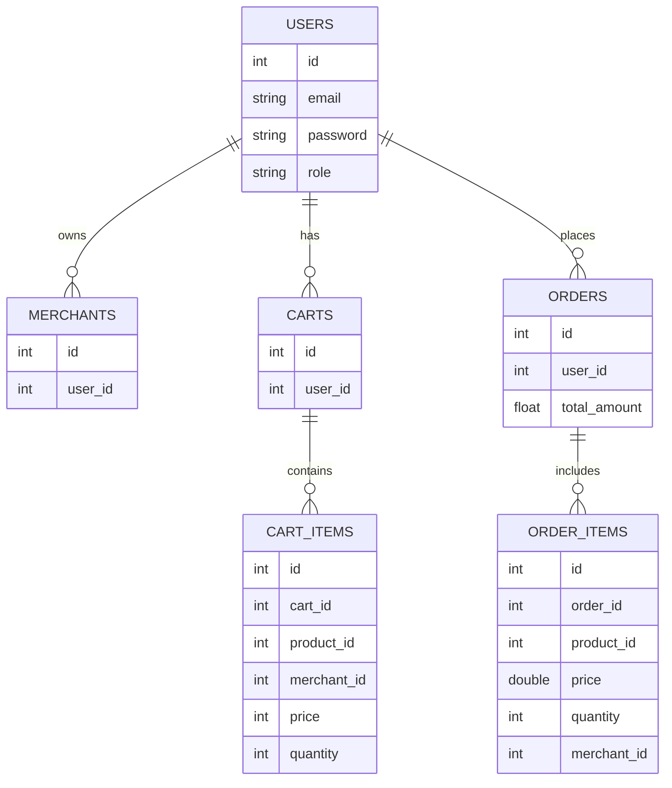

---

## User Service Component Diagram
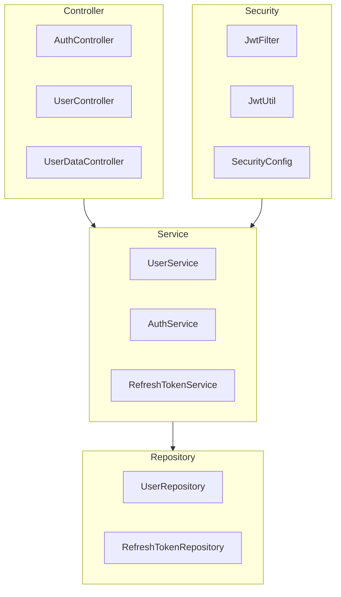

---

## Merchant Service Component Diagram
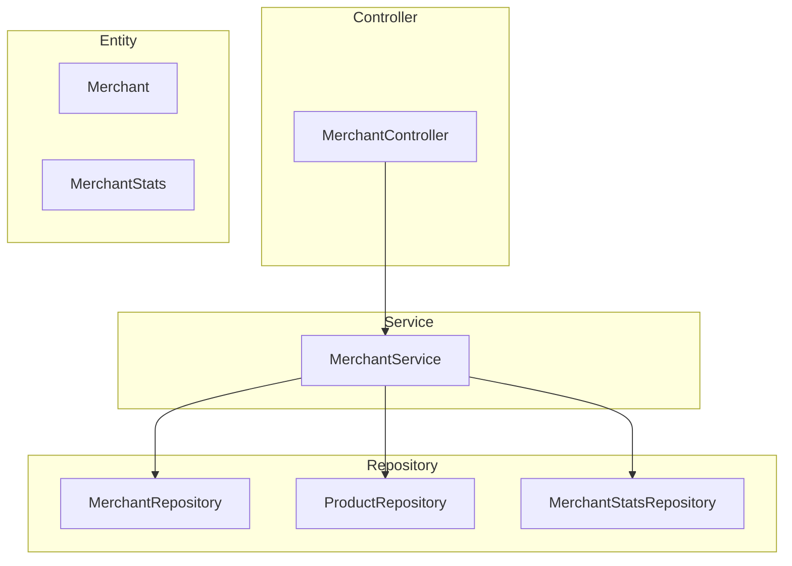

---

## Product Service Component Diagram
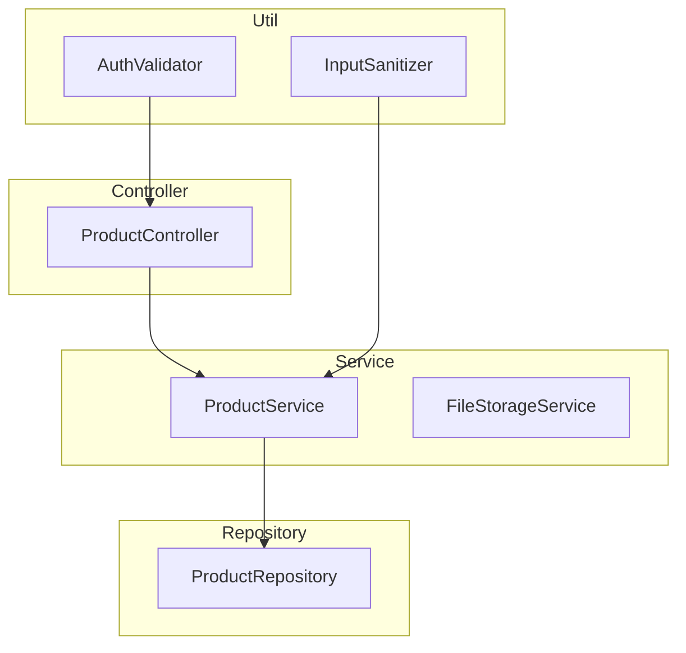

---

## Cart & Order Service Component Diagram
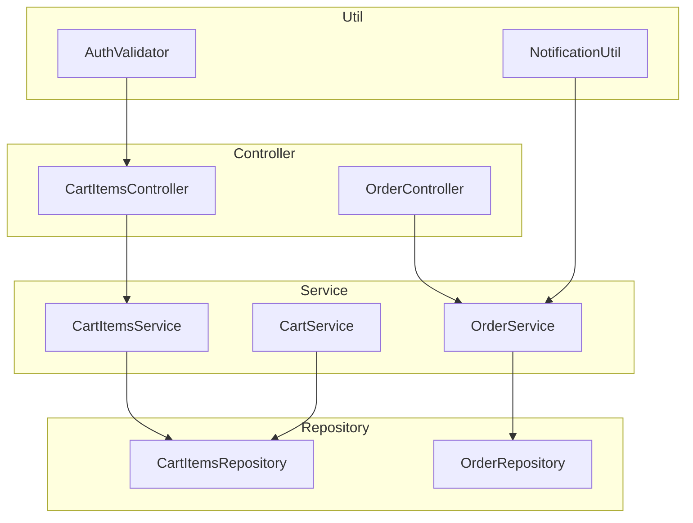

---

## JWT & Refresh Token Flow
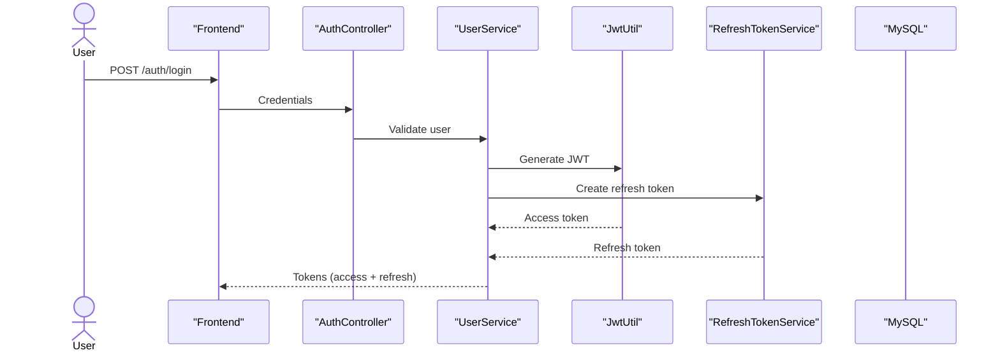

---

## Refresh Token Renewal Flow
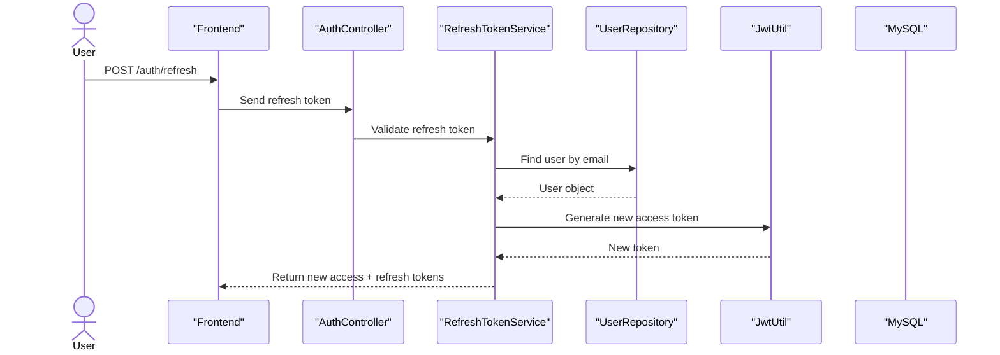
